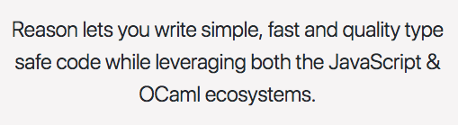

import { Head, Image } from 'mdx-deck'
import Information from './Information'
import BulletPoints from './bullet-points'

export theme from './theme'

<Head>
  <title>Node Server in ReasonML</title>
</Head>

# Building a Node Server in ReasonML

## A more maintainable way to node 

---

# What we will cover

---

# What we won't cover

---
# Reason Overview

---
# What is Reason?



<BulletPoints>
  <li>A programming language</li>
  <li>
    A way to build maintainable javaScript applications utilizing a battle hardened typesystem provided by 
    OCaml
  </li>
  <li>Functional Programming using JavaScript like syntax</li>
  <li>Compiles to JavaScript using the Bucklescript Compiler</li>
</BulletPoints>

```notes
- OCaml has been around since the early 1990's and is based on standard ML's type system which has been around since the 1970's. It features static typing and type inference. And since it has been around for so long developers can feel confident that they will be alerted at compile time if any new changes will break things.

- Reason is built on many of the paradigms you will find in other purely functional languages such as pattern matching, closures, and abstract types but has a syntax that will make those familiar with JavaScript feel at home. If you don't know what any of those features mentioned are don't worry you can still be productive without them.

- Leverages the bucklescript compiler to take OCaml's typesystem and Reasons syntax and output JavaScript that is easily readable by developers and can run in the browser and node.js environments.( or anywhere else you can run JavaScript)
```
---

# Express Overview

---

# What is express?

<BulletPoints>
  <li>A framework that makes it dead simple to build web servers and api's in node.js</li>
  <li>The most popular framework for Node.js in use today</li>
</BulletPoints>

---

## Express-bs

```notes
- Throughout building the express server show how you do it in JavaScript and how you do it in ReasonML as a side-by-side view.
```
